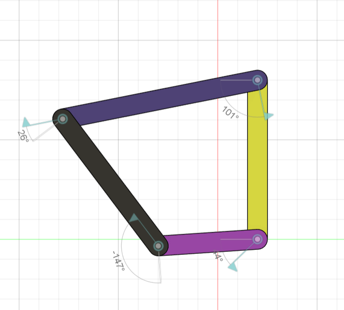
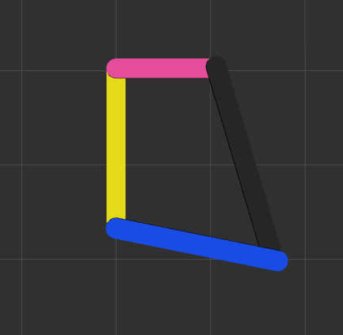

# 🤖 Four-Bar Linkage ROS2 Simulation

<div align="center">


### 🚀 Dynamic ROS2 Simulation of a Crank-Rocker Four-Bar Linkage Mechanism

Designed in **Fusion 360**, mathematically verified using **Grashof's Criterion**, and simulated in **ROS2 Humble + RViz2** with a custom real-time kinematics solver.

</div>

---

# 📖 Overview

This repository contains the complete implementation of **Assignment 1** for the **Mechatronics System Design** course.

The project demonstrates the complete workflow of:

- 🎨 Designing a Four-Bar Linkage in Fusion 360
- 📐 Verifying Grashof's Condition
- ⚙️ Converting the CAD model into URDF
- 🤖 Creating a ROS2 package
- 🧮 Solving the closed-loop kinematics using Python
- 🎥 Visualizing the mechanism dynamically in RViz2

Unlike conventional robot manipulators, a four-bar linkage is a **closed-loop mechanism**, while URDF only supports **tree structures**. This repository overcomes that limitation using a custom ROS2 node that continuously computes the required joint angles using inverse kinematics.

---

# ✨ Features

✅ Complete ROS2 Humble package

✅ Fusion 360 based mechanism

✅ Closed-loop four-bar linkage simulation

✅ Custom inverse kinematics solver

✅ Law of Cosines based joint calculations

✅ Smooth sinusoidal crank motion

✅ Real-time RViz2 visualization

✅ Automated build and launch scripts

✅ Detailed project report included

---

# 📸 Project Demonstration

## 🎨 Fusion 360 CAD Design

The four-bar linkage mechanism was first designed and validated in **Autodesk Fusion 360** before being translated into a ROS2-compatible URDF model.

### 🖼️ CAD Model

<p align="center">
  
</p>

### 🎥 CAD Motion Demo

https://github.com/mayankmittal29/LinkForge---ROS2-Four-Bar-Linkage-Simulator/blob/main/Fusion_360_video.mp4

> Demonstrates a full **360° crank rotation** validating the Grashof-compliant mechanism inside Fusion 360.

---

## 🤖 ROS2 + RViz2 Simulation

The CAD model is converted into a **URDF** and simulated in **ROS2 Humble**, where a custom Python node continuously solves the closed-loop kinematics and publishes joint states.

### 🖼️ RViz2 Simulation

<p align="center">
  
</p>

### 🎥 Simulation Demo


> Shows the real-time oscillatory motion of the four-bar linkage with dynamic joint updates, custom inverse kinematics, and RViz2 visualization.

---

# 🛠️ Technologies Used

| Technology | Purpose |
|------------|---------|
| 🐧 Ubuntu 22.04 | Operating System |
| 🤖 ROS2 Humble | Robotics Framework |
| 🐍 Python | Kinematics Solver |
| 📐 URDF | Robot Description |
| 🎨 Fusion 360 | CAD Design |
| 👁️ RViz2 | Visualization |
| 🔧 Colcon | Build System |

---

# 📂 Project Structure

```text
.
├── README.md
├── install_ros2.sh
├── build_and_run.sh
├── four_bar_linkage.urdf
├── MSD_Assignment1_Report.pdf
│
└── four_bar_linkage_ws
    └── src
        └── four_bar_linkage
            ├── package.xml
            ├── setup.py
            ├── launch
            │   └── display.launch.py
            ├── config
            │   └── rviz_config.rviz
            ├── urdf
            │   └── four_bar_linkage.urdf
            └── four_bar_linkage
                └── joint_state_publisher.py
```

---

# ⚙️ Working Principle

The simulation consists of four rigid links connected using revolute joints.

```
Ground (L1)
     ●────────────●
     │            │
     │            │
 Crank         Rocker
   (L2)         (L4)
      \        /
       \      /
       Coupler
        (L3)
```

The crank rotates continuously while the rocker oscillates.

Since URDF cannot directly represent closed-loop mechanisms, the linkage is modeled as an open kinematic chain.

A custom ROS2 node then computes the missing joint angle every frame to restore the closed-loop geometry.

---

# 📐 Link Dimensions

| Link | Description | Length |
|------|-------------|--------|
| 🟡 L1 | Ground | **80 mm** |
| 🔴 L2 | Crank | **50 mm** |
| ⚫ L3 | Coupler | **100 mm** |
| 🔵 L4 | Rocker | **80 mm** |

---

# 📊 Grashof Verification

For continuous crank rotation,

```
S + L ≤ P + Q
```

where

```
Shortest Link (S) = 50 mm

Longest Link (L) = 100 mm

Remaining Links

P = 80 mm
Q = 80 mm
```

Verification:

```
50 + 100 ≤ 80 + 80

150 ≤ 160 ✅
```

Hence,

✔ Grashof's Criterion is satisfied.

The mechanism therefore behaves as a **Crank-Rocker Four-Bar Linkage**.

---

# 🧮 Kinematics Solver

The simulation uses a custom Python node to compute the mechanism geometry in real time.

The solver:

- Computes the crank position
- Calculates triangle geometry
- Applies the **Law of Cosines**
- Selects the elbow-up configuration
- Publishes updated joint states continuously

Crank motion:

```
θ(t) = 90° + 30° sin(2πft)

where

f = 0.5 Hz
```

Motion Range:

```
60°  → 120°
```

This produces a smooth oscillatory motion of the complete mechanism.

---

# 🎨 Link Color Coding

| Link | Color |
|------|-------|
| 🟡 Ground | Yellow |
| 🔴 Crank | Pink |
| ⚫ Coupler | Black |
| 🔵 Rocker | Blue |

The same color convention is maintained throughout:

- Fusion 360
- URDF
- RViz2

making it easy to correlate CAD and simulation.

---

# 🚀 Installation

## Clone Repository

```bash
git clone <repository-url>

cd <repository-folder>
```

---

## Install ROS2 (if required)

```bash
chmod +x install_ros2.sh

sudo ./install_ros2.sh
```

The installation script automatically installs:

- ROS2 Humble
- RViz2
- robot_state_publisher
- Joint State Publisher
- Colcon
- Required dependencies

---

# ▶️ Running the Simulation

Simply execute:

```bash
chmod +x build_and_run.sh

./build_and_run.sh
```

The script automatically:

- Builds the workspace
- Sources ROS2
- Sources the workspace
- Launches RViz2
- Starts the custom joint state publisher
- Displays the moving four-bar linkage

---

# 📸 Expected Output

The simulation displays:

✅ Four-bar linkage

✅ Smooth crank oscillation

✅ Dynamic rocker movement

✅ Continuous closed-loop motion

✅ Correct link coloring

✅ Live RViz2 visualization

> *(You can add screenshots or GIFs here later.)*

---

# 📄 Included Files

| File | Description |
|------|-------------|
| `README.md` | Project documentation |
| `install_ros2.sh` | Automated ROS2 installation |
| `build_and_run.sh` | Build & Launch script |
| `four_bar_linkage.urdf` | Robot description |
| `joint_state_publisher.py` | Custom IK solver |
| `display.launch.py` | ROS2 launch file |
| `rviz_config.rviz` | RViz configuration |
| `MSD_Assignment1_Report.pdf` | Detailed project report |

---

# 📚 Learning Outcomes

This project demonstrates practical knowledge of:

- ✅ ROS2 Package Development
- ✅ URDF Modeling
- ✅ Fusion 360 CAD Design
- ✅ Robot Visualization
- ✅ Closed-Loop Kinematics
- ✅ Inverse Kinematics
- ✅ Law of Cosines
- ✅ Robot State Publishing
- ✅ RViz2 Configuration
- ✅ Colcon Workspace Management

---

# 🎯 Future Improvements

- [ ] Gazebo Simulation
- [ ] ros2_control Integration
- [ ] Interactive Joint Control
- [ ] STL Mesh Support
- [ ] MoveIt Integration
- [ ] Dynamic Physics Simulation
- [ ] GUI for Motion Parameters

---

# 📖 References

- ROS2 Humble Documentation
- RViz2 Documentation
- Fusion 360
- URDF Documentation
- Grashof's Criterion
- Law of Cosines

---

# 👨‍💻 Author

**Mayank Mittal**

B.Tech CSE

International Institute of Information Technology, Hyderabad (IIIT-H)

---

# ⭐ Support

If you found this project helpful:

🌟 Star this repository

🍴 Fork it

🛠️ Contribute

📢 Share it with others

---

<div align="center">

### ⭐ If you like this project, don't forget to give it a Star! ⭐

Made with ❤️ using ROS2, Python and Fusion 360

</div>
